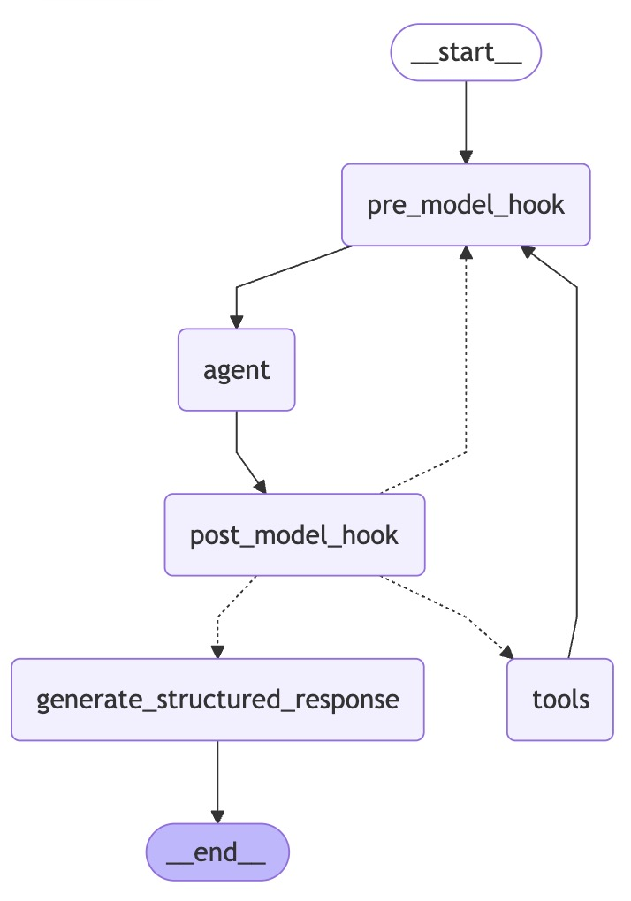
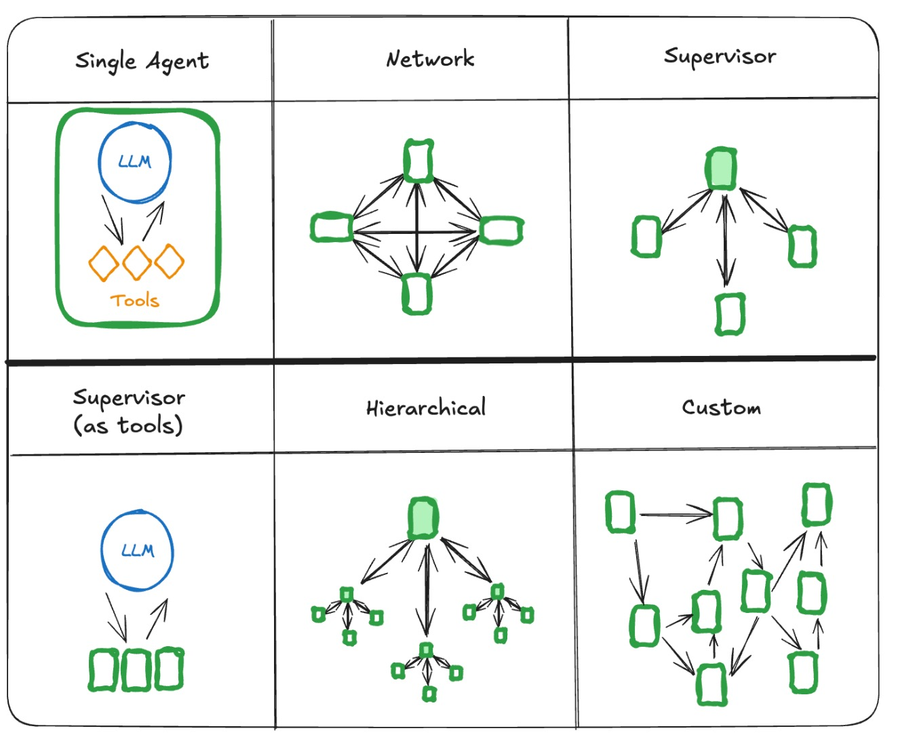

## 1.简介
### 基本安装
`pip install -U langgraph langsmith`

`pip install langchain-core langchain langchain_community langchain-openai`

### 本项目使用
- 代码来源于 LangGraph sdk==0.2.9版本 整理
- 在utils/.env文件中配置大模型信息
- 部分代码为伪代码，需修改使用

## 2.LangGraph Graph说明
### 图Graph的构成
- **State**: 图的共享数据结构，采用StateGraph封装为图，包含各种key的scheam
- **Nodes**: 图的节点:
    - 输入
        - state：图的状态
        - config：一个 RunnableConfig 对象，包含配置信息，如 thread_id 和追踪信息，如 tags
        - runtime：一个 Runtime 对象，包含运行时 context 和其他信息，如:
            - store
            - stream_writer
    - 输出是包含下个节点key的字典
- **Edges**: 图的边

## 3.LangGraph Agent说明

### 3.1.包生态系统
| 包（Package）     | 描述  | 安装命令                     |
|:-----------------|:------------------------|:-------------|
| `langgraph-prebuilt`（langgraph 的一部分） | 用于创建智能体的预构建组件                   | `pip install -U langgraph langchain`          |
| `langgraph-supervisor`            | 用于构建监督者（supervisor）智能体的工具     | `pip install -U langgraph-supervisor`         |
| `langgraph-swarm`                 | 用于构建集群（swarm）多智能体系统的工具      | `pip install -U langgraph-swarm`              |
| `langchain-mcp-adapters`          | 用于工具和资源集成的 MCP 服务器接口          | `pip install -U langchain-mcp-adapters`       |
| `langmem`                         | 智能体记忆管理：短期和长期                   | `pip install -U langmem`                      |
| `agentevals`                      | 用于评估智能体性能的工具                     | `pip install -U agentevals`                   |

### 3.2.可视化完整结构

- **tools**：智能体可用于执行任务的工具列表（函数、API 或其他可调用对象）。
- **pre_model_hook**：在调用模型之前调用的函数。可用于压缩消息或执行其他预处理任务。
- **post_model_hook**：在调用模型之后调用的函数。可用于实现护栏、人机协同流程或其他后处理任务。
- **response_format**：用于约束最终输出类型的数据结构，例如一个 pydantic 的 BaseModel。

### 3.3.多智能体架构

- NetWork 类型：提前设定好每个agent的返回结果包含 "next_agent_name"
- SuperVisorAgent决定接下来如何调用, 可以将子agent作为tools
- Hierarchical层级式: 最外层有1个大组长负责管理多个小组长，每个小组成管理自己的组内

